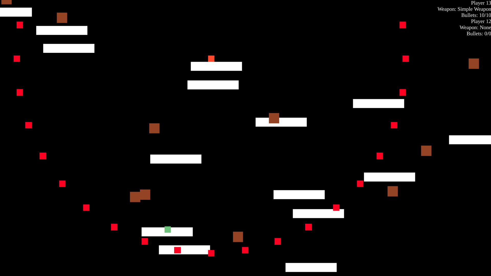
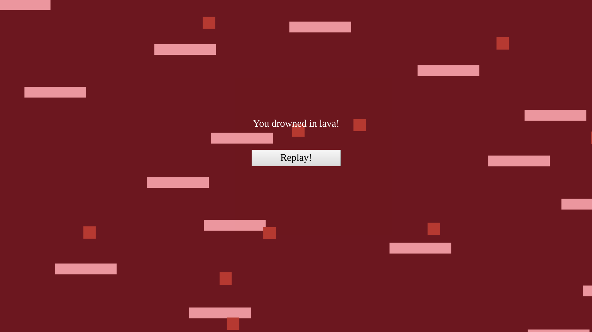

# The Floor Is Lava!

This is a multiplayer platformer game based on:
- client-server architecture
- web browser client
- [lance.gg](https://lance-gg.github.io) framework

---

---

## Install

`npm install`

## Development

- Open two terminals
- `npm run dev`
- `npm run nodemon`

## Gameplay

- Enter `localhost:3000`
- Follow the on-screen instructions to spawn
- See weapon and player state in top right corner
- Use arrows to control your character
- Use Enter to stop floating after spawning (so you can choose the plaform you want to spawn on beforehand)
- Jump with Space between white platforms
- Collect brown weapons and powerups
- Aim and shoot weapons with mouse
- Stay alive as long as possible!

